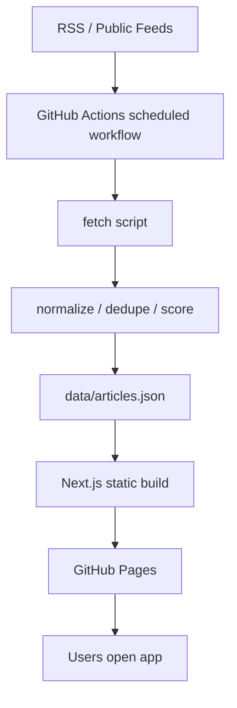

# 完全無料・毎朝8時JST更新のデザイン最新ニュースアプリ実装プラン

## 目的
完全無料の範囲内で、デザイン系ニュースを毎朝 8:00 JST に自動更新する静的ニュースアプリを構築する。公開リポジトリ前提で、取得元・ビルド・デプロイ・運用すべてを無料枠内に収める。

## 前提・制約
- リポジトリは **public** 運用
- 自動更新時刻は **毎朝 8:00 JST**
- **有料API禁止**、**有料ホスティング禁止**、**有料ビルド禁止**
- 著作権・利用規約配慮のため、原文全文の再配信は避け、**タイトル・要約・リンク・サムネイルの範囲**で表示
- 取得元は **RSS/公開API中心** とし、ログイン必須・有料化リスク・スクレイピング依存の高いソースは優先度を下げる

---

## 1. 情報源の調査・選定方針

### 採用候補（優先）
無料・公開アクセス・安定性の観点で、以下をコアソースにする。

#### A. Designer News
- 種別: デザイン/プロダクト系ニュースコミュニティ
- 採用理由:
  - デザイン文脈との親和性が高い
  - 公開フィードが見込め、ニュース集約元として使いやすい
  - コミュニティ起点で新しい記事を拾いやすい
- 用途:
  - 「業界トピック」「話題性」の補完

#### B. Hacker News
- 種別: テック/プロダクト/スタートアップ系
- 採用理由:
  - 公開RSSが広く利用されている
  - デザインそのものではないが、UI/UX/プロダクト設計関連記事が混ざる
  - 安定運用しやすい
- 用途:
  - プロダクトデザイン・UX・フロントエンド周辺の補完

#### C. CSS-Tricks
- 種別: CSS / UI実装 / フロントエンド
- 採用理由:
  - フロントエンド実装寄りのデザイン情報源として強い
  - RSS配信実績が長い
- 用途:
  - UI実装・CSS・レイアウト・アクセシビリティ

#### D. Smashing Magazine
- 種別: Web design / UX / frontend / accessibility
- 採用理由:
  - デザイン・UX・実装のバランスが良い
  - 長期的に信頼しやすいメディア
- 用途:
  - デザイン実務記事の中核ソース

### 初期版の推奨採用セット
- **Designer News**
- **Hacker News**
- **CSS-Tricks**
- **Smashing Magazine**

---

## 2. 技術スタックの選定

### 推奨構成
- フレームワーク: **Next.js (App Router) + Static Export 寄り運用**
- 言語: **TypeScript**
- スタイリング: **Tailwind CSS**
- フィード取得/整形: **Node.js + RSS parser系ライブラリ**
- データ保存: **リポジトリ内 JSON スナップショット**
- デプロイ先: **GitHub Pages**
- 自動更新: **GitHub Actions cron**

### Next.js を第一候補にする理由
- UIをモダンに作りやすい
- App Router で一覧・カテゴリ・詳細導線を整理しやすい
- 将来、検索・タグ・OG画像生成などを追加しやすい
- 静的ページ出力に寄せれば GitHub Pages と相性がよい

---

## 3. 無料運用アーキテクチャ



### 採用構成
#### データ取得
- GitHub Actions 上で定期実行
- RSS/公開フィードを取得
- ソースごとの差を吸収して共通フォーマットに正規化

#### データ保存
- `data/articles.json` にビルド入力として保存
- 追加で以下も保持:
  - `data/sources.json`
  - `data/last-updated.json`

#### 表示
- Next.js が静的HTML/JSとしてビルド
- GitHub Pages へ配信

---

## 4. 毎朝8時JST自動更新の仕組み

### 更新方式
- GitHub Actions の `schedule` を利用
- JST 08:00 は UTC では **23:00（前日）** に相当するため、cron は UTC 基準で設定
- ワークフロー内容:
  1. リポジトリ checkout
  2. Node セットアップ
  3. 依存関係インストール
  4. フィード取得スクリプト実行
  5. 静的ビルド実行
  6. GitHub Pages へデプロイ

### 推奨ワークフロー構成
- `.github/workflows/update-news.yml`
  - `schedule`
  - `workflow_dispatch`
  - build + deploy job

---

## 5. ホスティング選定

### 採用: GitHub Pages
- 長所:
  - public リポジトリ前提で完全無料に寄せやすい
  - GitHub Actions との統合が素直
  - 静的サイト配信に最適
- 理由:
  - 「完全無料」「public可」「毎日1回更新」の条件に最も素直に一致
  - ビルドとデプロイを GitHub 内で完結できる

---

## 6. UIデザイン方針

### デザインコンセプト
**モダン / ミニマル / 読みやすい / 余白重視 / ノイズの少ないニュースリーダー**

### 画面方針
#### Home
- 今日の主要記事一覧
- ソース別/カテゴリ別の絞り込み
- 最終更新時刻
- 注目記事セクション

#### UI要素
- 大きめの余白
- 低彩度ベース + 1色アクセント
- タイポグラフィ重視
- カードは情報を詰め込みすぎず、以下に限定
  - タイトル
  - 要約
  - ソース名
  - 公開日時
  - タグ
  - 外部リンク

---

## 7. データモデル設計

### 記事共通フォーマット
`data/articles.json` の各要素は以下を想定。

- `id`: 一意ID
- `title`: 記事タイトル
- `url`: 元記事URL
- `source`: 取得元名
- `sourceType`: `rss | api`
- `publishedAt`: ISO文字列
- `summary`: 短い要約
- `categories`: タグ配列
- `thumbnail`: 画像URL（取得できる場合のみ）
- `score`: 表示順制御用スコア
- `fetchedAt`: 取得時刻

### ソース定義
`data/sources.json`
- `id`
- `name`
- `type`
- `feedUrl`
- `siteUrl`
- `enabled`
- `priority`
- `categoryHints`

### 更新メタ
`data/last-updated.json`
- `updatedAt`
- `status`
- `successfulSources`
- `failedSources`

---

## 8. ディレクトリ構成案

```text
.
├─ .github/
│  └─ workflows/
│     └─ update-news.yml
├─ public/
│  └─ icons/
├─ scripts/
│  ├─ fetch-feeds.ts
│  ├─ normalize-items.ts
│  ├─ score-items.ts
│  └─ build-dataset.ts
├─ data/
│  ├─ sources.json
│  ├─ articles.json
│  └─ last-updated.json
├─ src/
│  ├─ app/
│  │  ├─ layout.tsx
│  │  ├─ page.tsx
│  │  └─ globals.css
│  ├─ components/
│  │  ├─ header.tsx
│  │  ├─ news-card.tsx
│  │  ├─ source-filter.tsx
│  │  ├─ tag-filter.tsx
│  │  └─ update-badge.tsx
│  ├─ lib/
│  │  ├─ feeds/
│  │  │  ├─ parser.ts
│  │  │  ├─ sources.ts
│  │  │  └─ dedupe.ts
│  │  ├─ format-date.ts
│  │  └─ scoring.ts
│  ├─ types/
│  │  └─ news.ts
│  └─ config/
│     └─ site.ts
├─ next.config.mjs
├─ tailwind.config.ts
├─ package.json
├─ tsconfig.json
└─ plan.md
```

---

## 9. 実装フェーズ

### Phase 1: プロジェクト基盤作成
#### 作業内容
- Next.js + TypeScript + Tailwind 構成を作成
- GitHub Pages 向け静的出力設定
- ベースレイアウト、フォント、テーマ定義

#### 主な対象
- `package.json`
- `next.config.mjs`
- `src/app/layout.tsx`
- `src/app/page.tsx`
- `src/app/globals.css`
- `tailwind.config.ts`

#### 完了条件
- ローカルで静的ビルド可能
- GitHub Pages 配信前提のパス設定が整理されている

### Phase 2: ソース定義と取得基盤
#### 作業内容
- 採用ソースを `data/sources.json` に定義
- RSS取得ロジックを作成
- ソース別のデータ差異を正規化
- 重複除去ルールを実装

#### 主な対象
- `data/sources.json`
- `scripts/fetch-feeds.ts`
- `scripts/normalize-items.ts`
- `src/lib/feeds/parser.ts`
- `src/lib/feeds/dedupe.ts`
- `src/types/news.ts`

#### 完了条件
- 複数ソースから共通JSONを生成できる
- タイトル/URL/日付欠損の基本ガードがある

### Phase 3: スコアリングと表示データ生成
#### 作業内容
- 新しさ・ソース優先度・カテゴリ適合で表示スコア計算
- 最新記事一覧JSONを生成
- 更新メタ情報を出力

#### 主な対象
- `scripts/score-items.ts`
- `scripts/build-dataset.ts`
- `src/lib/scoring.ts`
- `data/articles.json`
- `data/last-updated.json`

#### 完了条件
- 一覧表示に必要な JSON が安定して生成される
- 取得失敗時のフォールバック戦略が整理される

### Phase 4: UI実装
#### 作業内容
- ニュースカード一覧
- ソースフィルタ
- タグフィルタ
- 最終更新バッジ
- モバイル/デスクトップ対応

#### 主な対象
- `src/app/page.tsx`
- `src/components/news-card.tsx`
- `src/components/source-filter.tsx`
- `src/components/tag-filter.tsx`
- `src/components/update-badge.tsx`
- `src/components/header.tsx`

#### 完了条件
- 読みやすい一覧UIが成立
- フィルタ操作が直感的
- Lighthouse で基本的な可読性とパフォーマンスを満たす

### Phase 5: 自動更新・デプロイ
#### 作業内容
- GitHub Actions に定期実行ワークフロー追加
- ビルド成果物を GitHub Pages へ配信
- 手動実行も可能にする

#### 主な対象
- `.github/workflows/update-news.yml`
- `package.json` scripts
- GitHub Pages 設定

#### 完了条件
- 毎朝 8:00 JST 相当で更新が走る
- 失敗時の確認導線が明確

### Phase 6: 安定化・運用整備
#### 作業内容
- 失敗ソースの扱い改善
- 表示件数・スコア閾値調整
- README/運用ドキュメント整備
- ソース差し替えや追加手順の明文化

#### 主な対象
- `README.md`
- `plan.md`
- `data/sources.json`
- `scripts/*`

#### 完了条件
- 他人でも運用・拡張できる状態
- ソースの停止や変更に追従しやすい

---

## 10. 検証・DoD

### 検証項目
- RSS取得が主要ソースで成功する
- JSON生成が壊れない
- 重複記事が過剰表示されない
- 静的ビルドが通る
- GitHub Pages で崩れず表示される
- 毎朝 8:00 JST 相当で更新ワークフローが動く
- 1ソース失敗時もサイト全体は維持される

### Definition of Done
- 主要4ソース以上から記事集約できる
- public GitHub repository だけで運用可能
- 毎朝自動更新される
- UIがモダンでミニマルなニュースリーダーとして成立
- README と `plan.md` があり、再現・保守可能

---

## 11. ステップ → 対象 → 検証 の対応表

| Step | 主対象ファイル/領域 | 検証内容 |
|---|---|---|
| 1. 基盤作成 | `package.json`, `next.config.mjs`, `src/app/*` | 静的ビルド成立 |
| 2. ソース定義 | `data/sources.json`, `src/types/news.ts` | ソース設定が一貫している |
| 3. 取得処理 | `scripts/fetch-feeds.ts`, `src/lib/feeds/*` | フィード取得と正規化成功 |
| 4. データ生成 | `scripts/build-dataset.ts`, `data/*.json` | 記事JSONと更新メタ生成 |
| 5. UI構築 | `src/components/*`, `src/app/page.tsx` | 一覧・フィルタ・更新表示確認 |
| 6. 自動更新 | `.github/workflows/update-news.yml` | 定期更新と手動更新確認 |
| 7. 文書化 | `README.md`, `plan.md` | 再現手順と運用手順確認 |

---

## 12. 将来拡張案
- キーワード検索
- お気に入り保存（localStorageのみで無料維持）
- ダークモード切り替え
- 「News」と「Inspiration」の2タブ分離
- ソース品質スコアの調整UI
- 簡易OG画像生成

## 結論
初期版は **Next.js + GitHub Actions + GitHub Pages + RSS集約** が最適。完全無料・public運用・毎朝8時JST更新という条件に対して、もっとも単純で持続可能な構成である。
